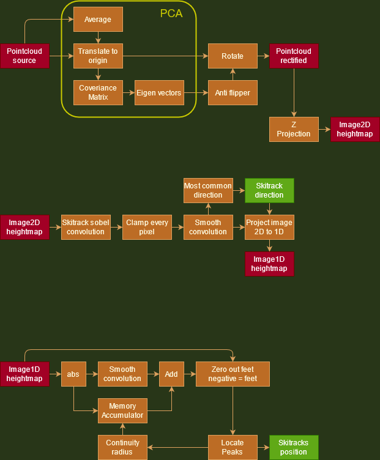

# LiDAR skitrack detector and tracker

## Hardware
* LiDAR CE30D
* Raspberry Pi 4

## Sources
* Driver for the LiDAR CE30D: https://github.com/iamkevinzhao/ce30_driver
* Driver for the LiDAR CE30C: https://github.com/CE30C/SDK-for-Windows
* Math library http://www.netlib.org/blas/
* Network library https://github.com/nanomsg/nng
* Misc header functions: https://github.com/KenthJohan/csc/
* Doc [ce30-d-datasheet1.pdf](ce30-d-datasheet1.pdf)
* Doc [ce30-d-datasheet2.pdf](ce30-d-datasheet2.pdf)

## Algorithm




## The visualizer
Understanding the visualizer and where LiDAR mount is presumed
Dark red,green,blue is origin orientation. Bright red,green,blue is ground orientation.


## Installing on Windows MSYS2

* https://www.msys2.org/


```
pacman -S mingw-w64-x86_64-qt-creator
pacman -S mingw-w64-x86_64-toolchain
pacman -S mingw-w64-x86_64-toolchain
pacman -S mingw-w64-x86_64-cmake
pacman -S mingw-w64-x86_64-cmake
pacman -S mingw-w64-x86_64-make
pacman -S mingw-w64-x86_64-boost
```

```
git clone https://github.com/nanomsg/nng
mkdir build
cd build
cmake .. -G "MinGW Makefiles" -DCMAKE_INSTALL_PREFIX=$MINGW_PREFIX
mingw32-make
mingw32-make install
```


## Installing on Linux
```
sudo apt-get install libblas-dev
sudo apt-get install libcblas-dev
sudo apt-get install liblapacke-dev

sudo apt-get install cmake
git clone https://github.com/nanomsg/nng
mkdir build
cd build
sudo cmake ..
sudo make
sudo make test
sudo make install
sudo ldconfig


```


